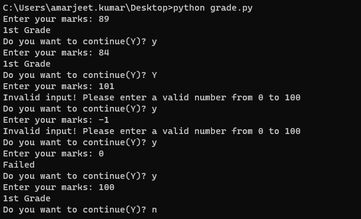

# Grade

```py
def grade(marks: int) -> str:
  '''
    This function will grade the student based on 
    their marks in range 0 to 100
  '''
  if marks > 80:
    return "1st Grade"
  elif marks >= 60:
    return "2nd Grade"
  elif marks >= 40 :
    return "3rd Grade"
  else:
    return "Failed"
```

